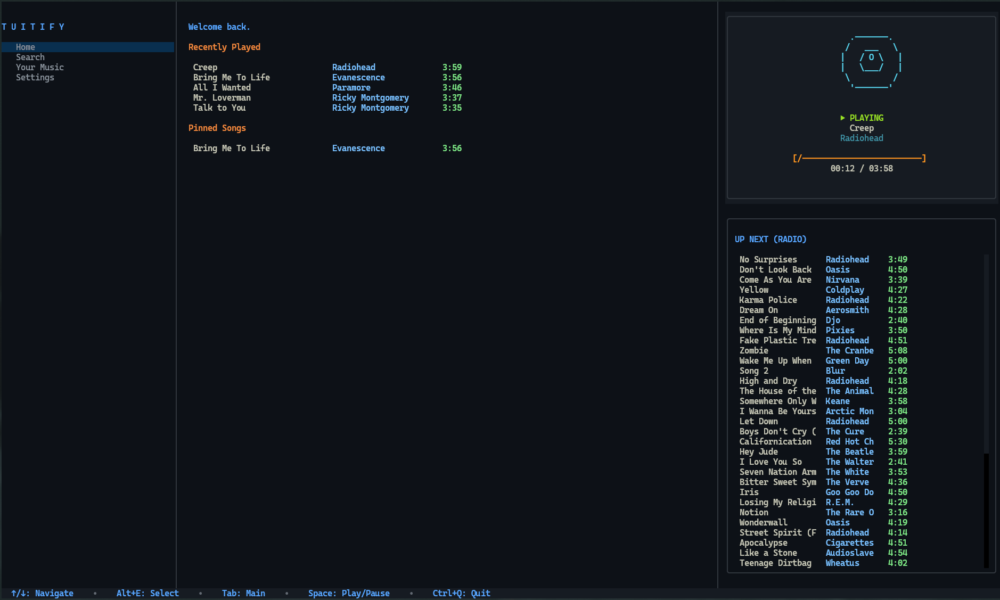
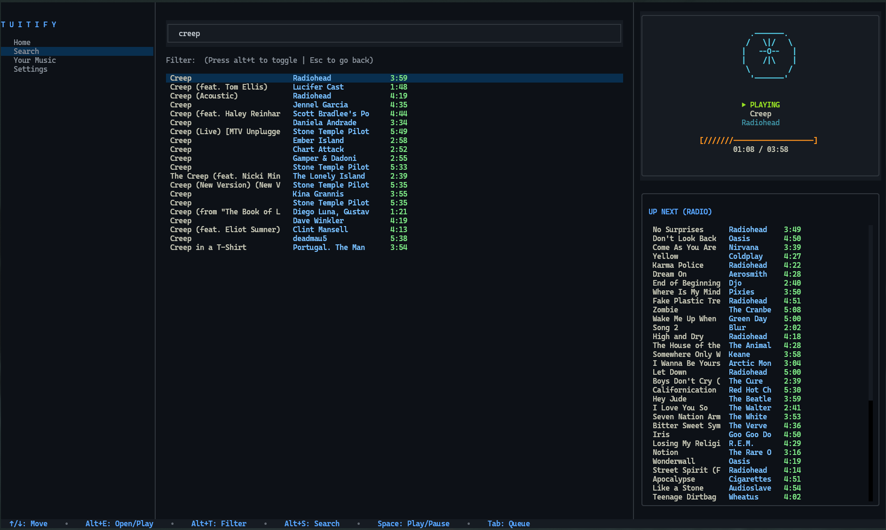
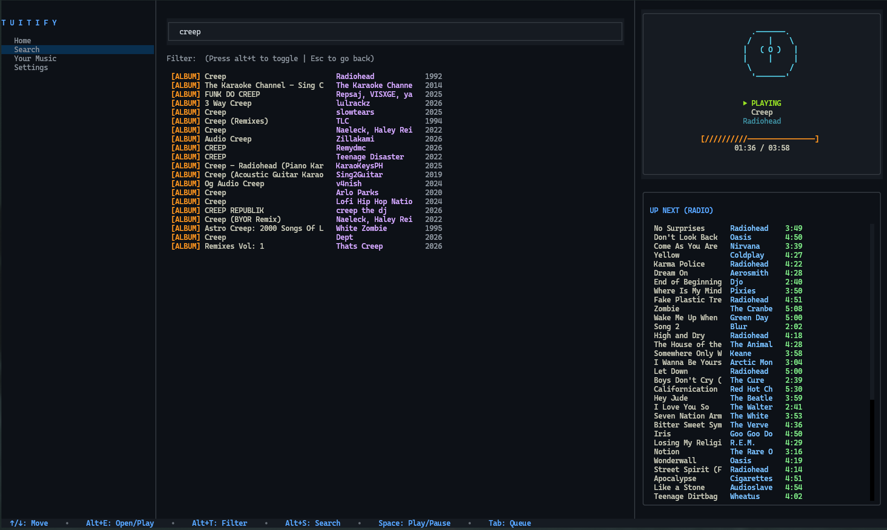
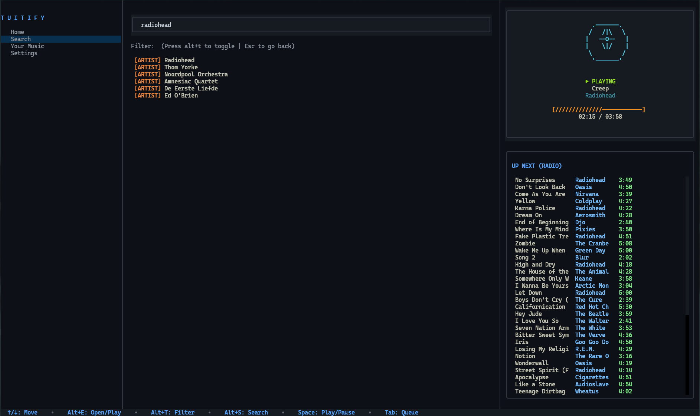
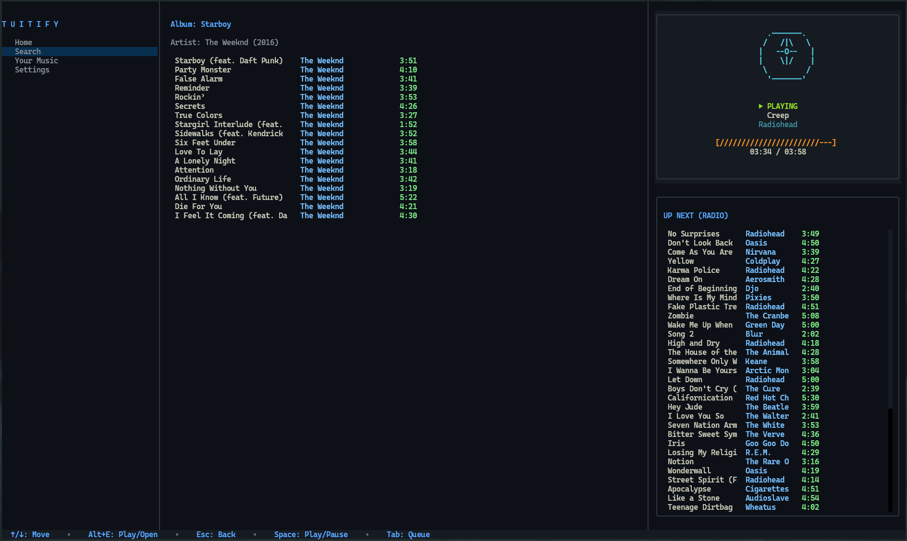
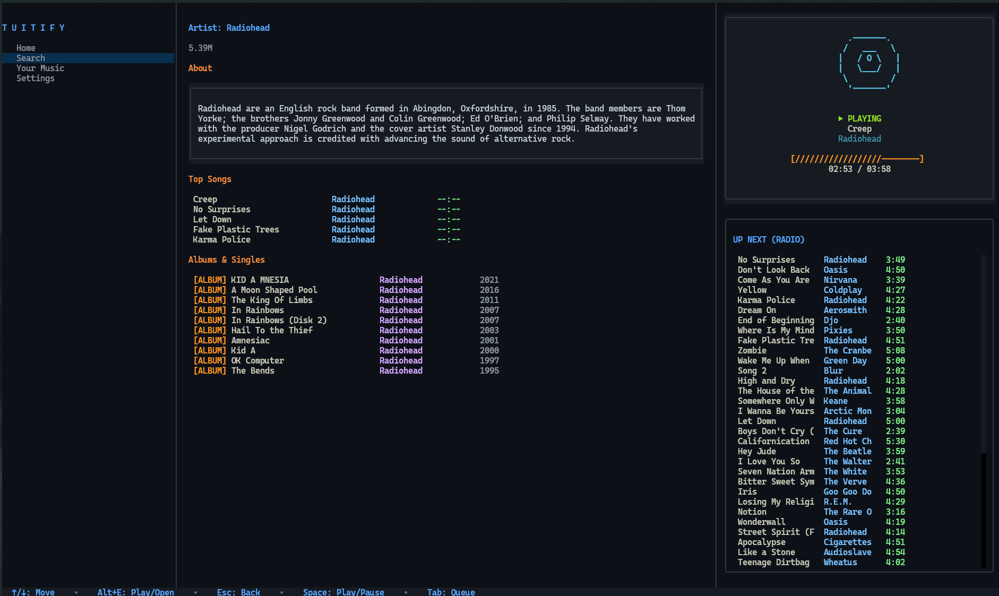

# Tuitify

A fast,modular keyboard driver music player that streams music to your terminal with realtime discovery, radio queue and background audio streaming.

## Architecture & How It Works

Tuitify is built around a clean modular concept; `main.py` acts as the orchestrator, drawing the UI and handling fron-end visuals while all computing is divided into their respective `<module-name>.py` file.
This allows Tuitify to add custom made modules to tailor it to your experience.


## Features

* **Three-Pane Layout:** Distinct, keyboard-navigable views for Navigation, Main Content, and Player/Queue.
* **Deep Music Discovery:** Instant searching across tracks, albums, and artist discographies with detailed biographies.
* **Dynamic Auto-Queue:** Seeds an infinite radio queue based on your selected song. Jump to any track in the queue without interrupting session flow.
* **Contextual Keybinds Footer:** A minimal status strip docked at the bottom that automatically displays commands relevant to your active panel.
* **ASCII Vinyl Animation:** Real-time spinning vinyl art and track progress bars synced to playback time.
* **Zero Audio Lingering:** Hard signal handling tears down background sockets and subprocesses instantly on exit.


## Keyboard Controls

### Global Navigation & Transport
| Key | Action |
| :--- | :--- |
| `Tab` | Cycle focus across panes (Menu $\to$ Main $\to$ Queue) |
| `Space` | Toggle Play / Pause |
| `Alt + E` | Select / Open item / Play track |
| `Ctrl + Q` | Force quit Tuitify immediately |

### Audio & Player Controls
| Key | Action |
| :--- | :--- |
| `Alt + J` / `Alt + L` | Seek backward / forward 5 seconds |
| `Alt + I` / `Alt + K` | Volume up / down (5%) |
| `Alt + M` | Toggle mute |
| `Alt + P` | Pin / Unpin currently playing song |
| `Alt + Q` | Toggle Queue visibility |

### Search & Drilldown Views
| Key | Action |
| :--- | :--- |
| `Alt + S` | Jump focus directly to the search bar |
| `Alt + T` | Toggle search category filter (`Songs` $\to$ `Albums` $\to$ `Artists`) |
| `Escape` / `Alt + B` | Go back from artist/album drilldowns to search results |
| `Alt + D` | Delete selected song from Recently Played or Pinned lists (Home) |


## Installation & Setup

### Prerequisites
* Python 3.10+
* `mpv` (Headless media player with IPC support). Tuitify will detect if `mpv` is missing and prompt you to install it automatically.

### 1. Clone the Repository
```bash
git clone https://github.com/Arihasaheadache/tuitify.git
cd tuitify
```

### 2. Set Up a Virtual Environment
```bash
python3 -m venv venv
source venv/bin/activate  # On Windows: venv\Scripts\activate
```

### 3. Install Dependencies
```bash
pip install -r requirements.txt
```

*(Ensure `yt-dlp`, `ytmusicapi`, `textual`, and `rich` are installed).*

### 4. Launch Tuitify
```bash
python3 main.py
```

## Interface

Home



Search







Album Info



Artist Info

